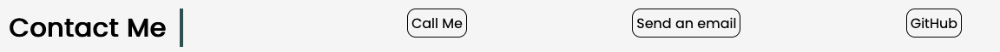

# Responsive Portfolio Challenge
--- This is a draft ---


## Description 

This project is the second challenge of the 2023-24 edX Front-End Development Bootcamp.
This project, a portfolio of work to showcase skills and talents to employers looking to fill a part-time or full-time position. 

---


## Pre

For this challenge a template has been given, however when tried to reach the outcome of the mock-up, i didn't succeed first. Later I found a developed site on Github Pages, which would serve the structure for the site.


## Development
**HTML**

The html structure followed the already mentioned template and whilst had been followed through with modifications, the majority of the work focused on appearance and functionality.

The overall color scheme based on "whitesmoke" and "black", for the sole reason of the Project section would be more engaging.

 


**logo**

For a more professional look, a logo has been designed and placed on the left side of navbar.

 


**Project Section**

The project listings have two added features: the caption has a 5px push to the right for a more appealing look, and the picture expands 3% on hover whilst the boreder disappears.


```
figcaption {
    padding: 4px;
    background-color: #000000;
    color: whitesmoke;
    position: absolute;
    bottom: 30px;
    right: -10px;
    border-radius: 5px;
    }
```

```
.portfolio img:hover {
    transform: scale(1.03);
    border: none;
    }
```


**Navigation**

Navigation is fixed on top, and navigation elements changes to reverse colors on hover


```
   position: fixed;
   top: 0;
   width: 100%;
   z-index: 5;
   border-bottom: 1px solid grey;
  
  ```


**Contact**

Section has actual actions, whilst holds the same design properties of the navigation elements.




```
<ul class="contactme">
            <li><a href="tel:+447767814399">Call Me</a></li>
            <li><a href="mailto:locsey@icloud.com">Send an email</a></li>
            <li><a href="https://github.com/oIdioN">GitHub</a></li>
```

```
    .contactme a:hover {
    background-color: black;
    color: whitesmoke;
    }
```


## Credits

The template for the project both for html and css came from the site https://apyosi.github.io/Portfolio-Template-Lernantino/index.html

Some images used is other designers work, as 

Header: Photo by <a href="https://unsplash.com/@balazscsaba2006?utm_content=creditCopyText&utm_medium=referral&utm_source=unsplash">Csaba Balazs</a> on <a href="https://unsplash.com/photos/man-smiling-while-sitting-and-using-macbook-q9URsedw330?utm_content=creditCopyText&utm_medium=referral&utm_source=unsplash">Unsplash</a>
  
Edupros image: Photo by <a href="https://unsplash.com/@mdesign85?utm_content=creditCopyText&utm_medium=referral&utm_source=unsplash">MD Duran</a> on <a href="https://unsplash.com/photos/woman-wearing-academic-cap-and-dress-selective-focus-photography-1VqHRwxcCCw?utm_content=creditCopyText&utm_medium=referral&utm_source=unsplash">Unsplash</a>

Icons used in Experience section provided by Simple Icons: <a href="https://simpleicons.org/?q=node">Simple Icons</a>


## Issues

This project has several areas which needs to be upgraded, and gradiually will during the course os the Bootcamp.


## License

The project served under the MIT License with the exception of usage of the logo.
A logo that includes artistic or design elements, (i.e. not just the name on its own), is legally regarded as being a work of artistic creation and therefore will be protected under copyright law therefore follows that, (other than activities specified under fair dealing rules), unauthorised copying of that logo would be an infringement.


## Badges

Built with:


## Features

The actual version  hence covers challenges requirements, the code will go through extensive rework from time to time, to add out-of-scope features, such as responsivity.
